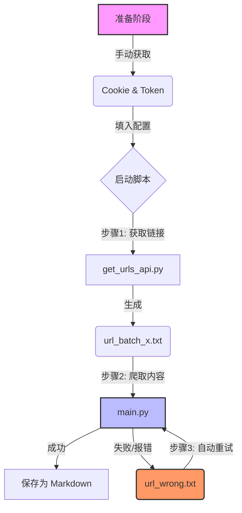

# 🕵️‍♂️ 全自动微信公众号采集流水线 (WeChat Article Crawler)
  
> **适用人群**：社会科学研究者、数据分析师  
> **核心功能**：批量抓取微信公众号历史文章，包含正文、阅读量、点赞数，支持断点续传。

---


## 📚 1. 项目架构 (Pipeline)

我们的工作流像一条工厂流水线，分为三个明确的步骤：

---mermaid
graph TD
    A[准备阶段] -->|手动获取| B(Cookie & Token)
    B -->|填入配置| C{启动脚本}
    C -->|步骤1: 获取链接| D[get_urls_api.py]
    D -->|生成| E(url_batch_x.txt)
    E -->|步骤2: 爬取内容| F[main.py]
    F -->|成功| G[保存为 Markdown]
    F -->|失败/报错| H(url_wrong.txt)
    H -->|步骤3: 自动重试| F
    
    style A fill:#f9f,stroke:#333,stroke-width:2px
    style F fill:#bbf,stroke:#333,stroke-width:2px
    style H fill:#f96,stroke:#333,stroke-width:2px

### ✨ 核心特性

* **全自动采集**：只需配置一次 Token 和 Cookie，即可批量获取 URL。
* **数据完整**：支持抓取**正文内容**、**发布时间**、**阅读量**、**点赞数**及**在看数**。
* **格式友好**：自动清洗 HTML 标签，移除干扰广告，生成干净的 `.md` 文件。
* **高容错性**：
    * 支持断点续传（网络中断不丢失进度）。
    * 自动记录失败链接，支持一键重试。
* **小白友好**：提供 `.bat` 交互式启动脚本，无需敲代码即可运行。

---

## 📂 项目结构

上传到 GitHub 前，请确保你的文件夹结构如下：

```text
WeChat_Crawler/
├── police_country_articles/   # [输出] 抓取到的文章会保存在这里
├── get_urls_api.py            # [核心] 步骤1：用于获取文章链接列表
├── main.py                    # [核心] 步骤2：用于下载文章内容和统计数据
├── resume_helper.py           # [工具] 辅助工具：用于程序中断后生成剩余任务列表
├── 启动爬虫.bat                # [启动器] Windows用户点击这个即可运行全流程
├── requirements.txt           # 依赖库列表
└── README.md                  # 说明文档

自然语言描述：（任务SOP）我每次登录一个个人的微信公众账号，
然后在home处抓包获取token和Cookie，
然后再每次利用get_urls_api.py获取50*5个页面的url存储在url_(X-X+50).txt的文档中，
然后再利用main.py对这个txt文件中的内容进行内容的存储，
然后尽量保证内容、点赞量&阅读量单独爬取，防止微信封号，
然后这里面涉及到了错误处理（存储）（出现中间断点后，kill Terminal / ctrl + c暂停进程的情况话，我们利用resume_helper.py来进行任务完成度检测，并且单独存储剩下来的所有url，防止研究者找不到url的位置，因为本研究缺乏固定的标签

#### 小白解释：
### 第一部分：项目总控文档 (WeChat_Crawler_Guide.md)

你可以直接复制下面的内容，保存为 `README.md` 或 `使用说明书.md`。

Markdown

```
# 🕵️‍♂️ 全自动微信公众号采集流水线 (WeChat Article Crawler)

> **项目代号**：Project Fayi  
> **适用人群**：社会科学研究者、数据分析师  
> **核心功能**：批量抓取微信公众号历史文章，包含正文、阅读量、点赞数，支持断点续传。

---

## 📚 1. 项目架构 (Pipeline)

我们的工作流像一条工厂流水线，分为三个明确的步骤：



------

## 🛠️ 2. 环境安装 (第一次运行前做)

在开始之前，请确保电脑已安装 Python。

1. **解压项目包**：确保所有 `.py` 文件在同一个文件夹里。

2. **安装依赖**： 在文件夹空白处 -> 右键 -> "在终端中打开" -> 输入以下命令并回车：

   Bash

   ```
   pip install requests beautifulsoup4 html2text
   ```

------

## 🚀 3. 标准操作流程 (SOP)

### 🟢 第一步：搞到“通行证” (抓包)

**目的**：让代码假装是你，登录微信后台。

1. 电脑浏览器登录 [微信公众平台 (mp.weixin.qq.com)](https://mp.weixin.qq.com/)。
2. 登录后，按键盘 `F12` 打开开发者工具，点击顶部的 **Network (网络)** 标签。
3. 刷新一下网页。
4. **找 Token**：看浏览器地址栏网址，找到 `token=xxxx`，复制这串数字。
5. **找 Cookie**：在 Network 列表中随便点一个请求（如 `home`），右侧 Headers 里找到 `Cookie:`，复制冒号后面整段长字符串。
6. **找 appmsg_token (关键)**：
   - 在电脑微信里随便点开一篇公众号文章。
   - 或者在浏览器 Network 里搜索 `getappmsgext`。
   - 找到 `appmsg_token` 参数并复制。

### 🟡 第二步：修改配置 (填入弹药)

右键点击脚本，选择“用记事本打开”或 VS Code，填入刚才获取的信息。

- **打开 `get_urls_api.py`**：
  - 修改 `TOKEN` 和 `COOKIE`。
  - 修改 `START_PAGE` (起始页) 和 `END_PAGE` (结束页)。
- **打开 `main.py`**：
  - 修改 `self.cookie`。
  - 修改 `self.appmsg_token` (为了抓阅读量)。
  - 确认 `input_file` 是你刚才生成的文件名 (如 `url_(1-50).txt`)。

### 🔵 第三步：启动流水线

#### 1. 抓取链接

运行 `get_urls_api.py`。

- **输入**：公众号名称、页码范围。
- **输出**：一个包含几百个链接的 `.txt` 文件 (例如 `url_(1-50).txt`)。

#### 2. 抓取正文

运行 `main.py`。

- 程序会自动读取链接，模拟浏览器访问。
- **输出**：文章会被保存为 `.md` 文件，存放在 `police_country_articles` 文件夹中。
- **容错**：如果遇到网络波动，失败的链接会自动存入 `url_wrong.txt`，程序结束后会询问是否立即重试。

------

## 🚑 紧急救援指南

**Q: 程序卡住不动了，或者我手滑关掉了窗口怎么办？** A: 别慌，我们有断点续传机制。

1. 打开 `resume_helper.py`。
2. 把你文件夹里**最后生成**的那篇文章的链接粘贴进去。
3. 运行脚本，它会生成一个 `remaining_urls.txt`。
4. 去 `main.py` 里把读取的文件改成 `remaining_urls.txt`，再次运行即可。

**Q: 为什么阅读量是空的？** A: `appmsg_token` 过期了（有效期很短），或者你没填。重新在电脑微信点开一篇文章抓个新的。

**Q: 出现 `200013` 报错？** A: 抓太快被微信封控了。去喝杯咖啡，休息 1-2 小时再试。
